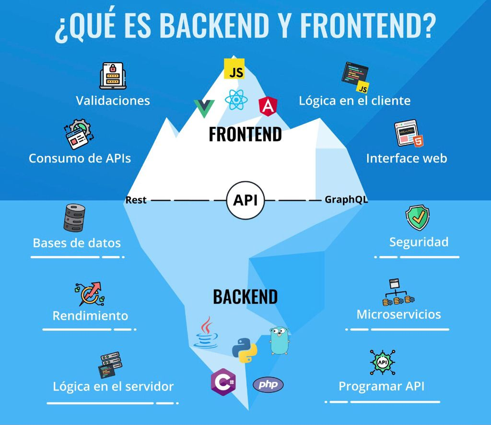
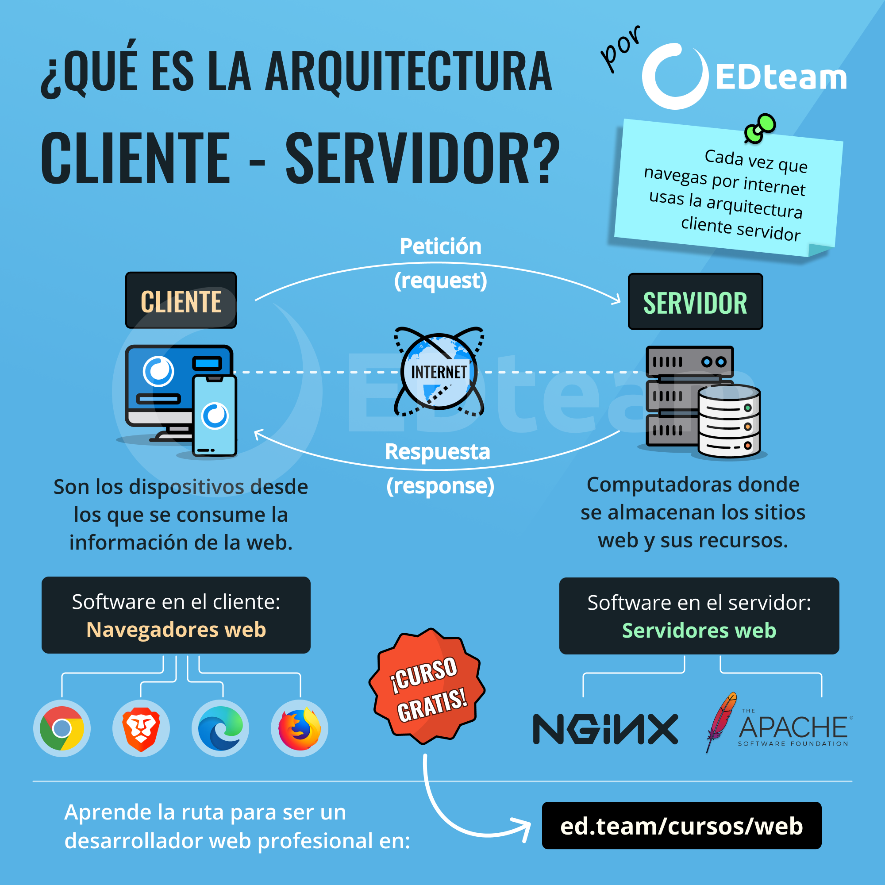
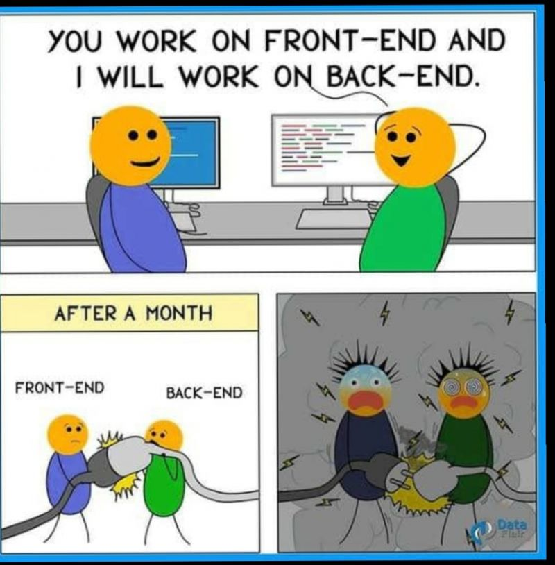
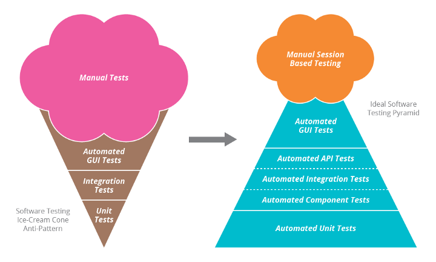
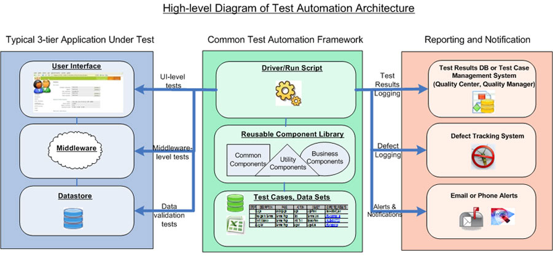
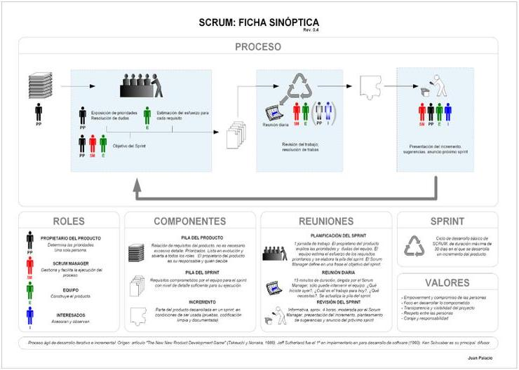
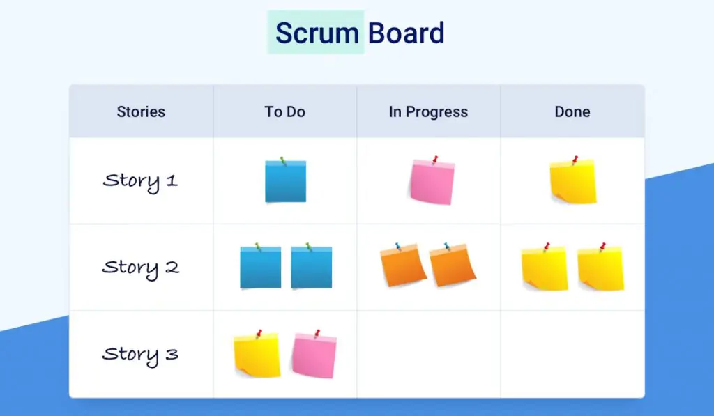

# Introducción

## ¿Qué es la Web?

* Es un conjunto de documentos que se conectan a través de hipervínculos, junto con la web nace HTML, este lenguaje de marcado permite escribir documentos que puedan conectarse entre ellos.
* El 6 de agosto de 1991, Tim Berners-Lee, publicó el proyecto de la World Wide Web en el grupo de noticias alt.hypertext y con este suceso la Web comenzó a ser un servicio disponible públicamente en Internet.

## Página vs Sitio vs Aplicación

* **Página Web**:
  * Documento HTML (Hyper Text Markup Language) que puede tener CSS (Cascading Style Sheets), JS (lenguaje de programación), imágenes o videos.
  * Es cada pantalla de un sitio web o app web.
  * Puede ser dinámica (con Base de Datos) o estática (sólo código)

* **Sitio Web**:
  * Conjunto de páginas web estructuradas en un dominio.
  * Informa lo que hace una empresa (no es el negocio en si)
  * Pueden ser creadas por desarrolladores o personas que no sepan programar.

* **Aplicación Web**:
  * Software desarrollado con tecnologías web.
  * Es el núcleo del negocio de la empresa.
  * Se crea con código.
  * Son creadas por desarrolladores web profesionales.

## Página web: estática vs. dinámica

| Estática | Dinámica |
| -- | -- |
| La información está escrita directamente en el código | La información se lee desde una BD o una API |
| El contenido que ven los usuarios siempre es el mismo | La información de la página se adapta a cada uno de los usuarios |
| Cambiar la información implica modificar el código | Se puede editar el contenido a través de una interfaz |
| Su uso es común en sitios que cambian muy poco (publicidad, documentación) | Utilizada en sitios que cambian con frecuencia (ecommerce, redes sociales) |

## Desarrollo web

* Se divide en:
  * **Frontend**: es la parte encargada del lado del cliente (lo que se observa en pantalla)
    * Validaciones
    * Consumo de APIs
    * Lógica en el cliente (JS)
    * Interfaces Web (HTML5)
  * **Backend**: es la parte encargada del lado del servidor (no es visible)
    * Bases de Datos
    * Rendimiento
    * Lógica en el servidor (Java, Python, GO, C#, php)
    * Seguridad
    * Microservicios
    * Programar API

## API

* API: Application Programming Interface.
* Una interfaz es una capa que conecta dos sistemas.
* Una API es una interfaz que conecta aplicaciones para que compartan información.
* API Rest:
  * Rest es una arquitectura para APIs que se conectan vía web con el protocolo HTTP.
  * Permite acceder a la información con identificadores únicos (URI)

## Arquitectura Cliente Servidor

* Cada vez que navegas por Internet, usas la arquitectura cliente - servidor.

## Roles del Frontend

* **Diseñador UI**: diseña los flujos de usuario, las pantallas e interacciones en un programa de diseño (no escribe código)
* **Maquetador**: lleva el diseño a código HTML y CSS. No se preocupa de la lógica, sólo de la presentación.
* **Programador frontend**: agrega datos reales desde una API y lógica a la presentación creada por el maquetador.

## Roles del Backend

* **Backend developer**: se encarga de la lógica del negocio (el código del lado del servidor) y crea las APIs para que el frontend pueda consumirlas.
* **Database administrator**: diseña, implementa, mejora y mantiene el sistema de base de datos.
* **Admonistrador del servidor**: gestiona la instalación, soporte y mantiene el servidor en donde se aloja la web o app.

## Browser

* Cada navegador web cuenta con un motor de renderizado.
* Renderizado es un proceso que ejecutan los motores de los navegadores web, que al cargar un sitio web, leen en tiempo real el código de los tags HTML, CSS y JavaScript, para poder transformarlos en los componentes visuales y textos formateados que conforman una web.
* Cada motor es particular, hay que lograr la compatibilidad necesaria para respetar al menos el desempeño de nuestras web en los navegadores más populares del momento. Recurso Web: www.caniuse.com
* Principales browsers:
  * Opera (1996)
  * Safari (2003)
  * Mozilla Firefox (2004)
  * Chrome (2008)
  * Brave (2016)
  * Edge Chromium (2020)

## URL (Universal Resource Locator)

* Se ocupa de enlazar recursos, que se mueven a través de direcciones IP o nombres de dominios.
* Es la dirección que se escribe en la barra de direcciones del navegador, sirve para acceder a un sitio web.
* Ejemplo: www.minegocio.com

## Dirección IP (Internet Protocol)

* Es uno de los “estándares” por el cual funciona la internet.
* Su fin es optimizar el envío de paquetes de datos.
* Para facilitar este envío, cada dispositivo conectado a internet recibe un número único.
* Las de mayor uso fueron las IPv4 formadas por cuatro números separados con puntos. Cada número representa un byte.
* Ejemplo: 172.54.221.6

## Servidor Web

* Programa que se encuentra escuchando o esperando constantemente por una petición realizada desde la red.
* Cuando se recibe esta petición el servidor realiza la acción correspondiente, o responde de la manera adecuada y sigue escuchando.
* Un servidor WWW dialoga (o se comunica) con sus clientes a través del protocolo HTTP
* **Hosting**: es el espacio en un servidor donde se aloja un sitio web para que este pueda ser visible en Internet.

## Framework

* Conjunto de herramientas adaptables para ejecutar proyectos de forma ordenada y eficiente.
* Desarrolla proyectos completos o parte de un proyecto.
* Permite ahorrar tiempo y organizar mejor un proyecto.
* Existen frameworks para multimedia, aplicaciones web, tecnologías AJAX, gestión de contenidos, aplicaciones en general.
* Su uso no es paso obligatorio en el desarrollo de software, pero es muy usado dado el ahorro de tiempo que supone.
* Ejemplos: Vue, Django, Laravel, Angular, etc.

## Editor de código

* Es una herramienta especializada en desempeñar una tarea muy específica, editar archivos para escribir y modificar código.
* Ejemplos: Sublime Text, Atom, Visual Studio Code, NotePad++, Brackets, etc.

## Etapas básicas en el desarrollo de un proyecto web

1. **Planificación**: documenta los requerimientos del proyecto y las tecnologías a utilizar.
1. **UX/UI**: define los flujos e interacción del usuario y diseña la interfaz gráfica.
1. **Desarrollo**: desarrolla la UI, la BD y la lógica de la app.
1. **Despliegue**: verifica que el proyecto cumple con los requerimientos y se sube a producción.
1. **Soporte**: se corrigen errores no detectados en el desarrollo de la aplicación.

## La importancia del Testing

* Permite definir la fiabilidad y la robustez que la aplicación íntegra, y también los errores, conocidos como bugs, que esta tiene.
* La finalidad es pulir al máximo el control de errores, para entregar un producto lo más cercano a la perfección.
* La planificación de pruebas de usuario no debe ser un tema propio del área de QA, sino que debe estar encarada desde los inicios del diseño de toda aplicación (análisis funcional, desarrollo de software, testing).
* La usabilidad y la experiencia de usuario son factores clave en el momento de testear una aplicación. 

## Automatización de tests

* Pone entre el tester y la aplicación de software un programa diseñado para controlar la ejecución de pruebas, y comparar de manera más rápida los resultados obtenidos y los resultados esperados.
* Generar reportes con las pruebas exitosas y fallidas.
* Guarda las métricas necesarias.
* Herramientas: Selenium, Cypress, HP Quicktest Professional, Rational Functional Tester, etc.

## Metodología de Trabajo

* Antiguo modelo de cascada: Diseño -> Desarrollo -> Testing
* Scrum:
  * Es un marco de trabajo ágil que orienta en el desarrollo de un proyecto en forma flexible y con adaptación rápida a los cambios.
  * Permite actividades en equipo a través de procesos de interacciones.

